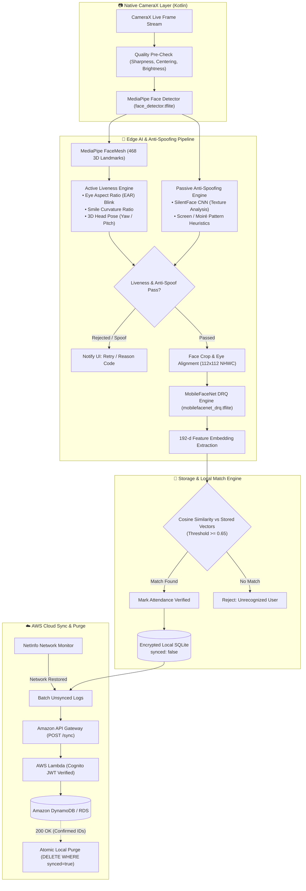

# FaceField 

> **High-Performance, Offline-First Facial Recognition & Dual-Layer Liveness Attendance System**  
> *Engineered for zero-connectivity edge deployments, fraud prevention, and autonomous cloud synchronization.*

[--green.svg?logo=android&logoColor=white)](https://developer.android.com)
[](https://reactnative.dev)
[](https://kotlinlang.org)
[](https://tensorflow.org/lite)
[](https://developers.google.com/mediapipe)
[](docs/aws_integration.md)
[]()

---

## 📑 Table of Contents

- [The Mission & Problem Statement](#-the-mission--problem-statement)
- [System Architecture & CV Pipeline](#-system-architecture--cv-pipeline)
- [Key Features & Core Capabilities](#-key-features--core-capabilities)
- [Machine Learning & Computer Vision Specifications](#-machine-learning--computer-vision-specifications)
- [Cloud Synchronization & Purge Engine](#-cloud-synchronization--purge-engine)
- [Application Flow & Screens](#-application-flow--screens)
- [Tech Stack](#-tech-stack)
- [Repository Structure](#-repository-structure)
- [Installation & Quick Start](#-installation--quick-start)
- [Local Setup & Build Guide](#-local-setup--build-guide)
- [Security, Privacy & Anti-Spoofing Defense](#-security-privacy--anti-spoofing-defense)

---

## 🎯 The Mission & Problem Statement

Workforce management in remote sectors—such as mining sites, maritime vessels, infrastructure projects, rural health centers, and underground facilities—faces a common barrier: **zero or intermittent internet connectivity**.

Traditional biometric attendance systems fail in these environments due to:
1. **Network Dependence:** Latency or outright failure when calling remote biometric APIs.
2. **Vulnerability to Spoofing:** Inability to differentiate 2D printed photographs, digital screen replays, and video loops without specialized hardware.
3. **Storage Creep:** Accumulating uncompressed images and event logs locally until device memory is exhausted.

**FaceField** solves this with an edge-native architecture:
- **100% On-Device Inference:** Face localization, 3D landmark mesh extraction, active/passive liveness detection, and 192-dimensional vector comparison execute locally in **< 80ms** without sending images over the wire.
- **Dual Anti-Spoofing Shield:** Combines active biometric challenges (EAR blink verification, smile detection, head pose yaw/pitch) with passive neural texture/Moiré pattern analysis.
- **Autonomous Sync & Purge:** Event logs are buffered in encrypted local SQLite with atomic state tracking, synchronized to AWS upon network restoration, and immediately purged to keep the device footprint minimal (< 20MB).

---

## 🏗️ System Architecture & CV Pipeline

FaceField uses a hybrid architecture: a responsive **React Native (TypeScript)** UI coupled to a custom **AndroidX CameraX** native analyzer in **Kotlin**, driving TensorFlow Lite and MediaPipe pipelines directly on the device CPU/GPU.



---

## ✨ Key Features & Core Capabilities

### 1. Dual-Layer Anti-Spoofing Architecture
- **Active Liveness Engine:** Tracks continuous eye aspect ratio (EAR) to detect blinks, measures mouth landmark deflection for smile detection, and calculates Euler angles (yaw, pitch, roll) to ensure active user participation.
- **Passive Neural Texture Analysis:** Employs the `SilentFace` convolutional neural network to inspect micro-textures, specular highlights, and paper surface reflectance.
- **Moiré & Screen Rejection:** Evaluates high-frequency spectral gradients to detect refresh artifacts and pixel grids characteristic of LCD/OLED screens.

### 2. High-Speed Edge Biometric Recognition
- **Sub-80ms Execution:** Powered by Dynamic Range Quantized (DRQ) MobileFaceNet running on Google LiteRT.
- **192-Dimensional Vector Embeddings:** High discriminative capability across facial variations, glasses, and varied illumination.
- **Strict Cosine Thresholding:** Enforces a configurable cosine similarity cutoff (default: **$\ge 0.65$**) to prevent false acceptances.

### 3. Native CameraX Integration
- Replaces bridge-heavy camera libraries with a purpose-built `CameraXView` native component in Kotlin.
- Direct `ImageAnalysis.Analyzer` frame buffer processing eliminates JavaScript bridge serialization overhead.

### 4. Zero-Data-Loss Offline Attendance & Atomic Purge
- Attendance events persist locally in SQLite under an immutable audit log structure.
- When an internet connection is re-established, the background sync worker automatically sends batched records to the cloud.
- Once the backend returns `200 OK`, the device safely purges synced entries to prevent device storage degradation.

---

## 🧠 Machine Learning & Computer Vision Specifications

| Component | Model / Engine | Input Resolution | Format / Quantization | Purpose & Key Metrics |
| :--- | :--- | :--- | :--- | :--- |
| **Face Detection** | `face_detector.tflite` | $192 \times 192$ RGB | MediaPipe Task Float16 | Real-time face detection & bounding box computation. |
| **Facial Mesh** | MediaPipe FaceMesh | Cropped Face ROI | 468 3D Landmarks | Landmark tracking for head pose, eye openness, and smile curvature. |
| **Face Recognition** | `mobilefacenet_drq.tflite` | $112 \times 112$ RGB | Dynamic Range Quantization (DRQ) | Extracts 192-d normalized embeddings. Cosine similarity threshold $\ge 0.65$. |
| **Passive Anti-Spoofing** | `silentface_4_0_drq.tflite` | $80 \times 80$ RGB | Dynamic Range Quantization (DRQ) | Binary liveness classification (genuine skin vs. photo/screen spoof). |
| **Texture / Moiré Guard** | Heuristic Frequency Kernel | Native ROI | OpenCV-grade Native Math | High-frequency screen gradient detection & pixel grid rejection. |

---

## ☁️ Cloud Synchronization & Purge Engine

```
[Device Offline] ──> Accumulate Check-ins (synced = false)
                            │
                     (Internet Restored)
                            ▼
[NetInfo Event]  ──> Read Unsynced Batch ──> POST /sync-attendance (Bearer JWT)
                                                    │
                                                    ▼
                                            [AWS API Gateway]
                                                    │
                                                    ▼
                                              [AWS Lambda]
                                                    │
                                                    ▼
                                            [Amazon DynamoDB]
                                                    │
                                          (HTTP 200 OK + IDs)
                                                    ▼
[Device Local]   <── Purge Synced Records (DELETE WHERE id IN (synced_ids))
```

For full implementation schemas, DynamoDB table designs, and retry/backoff policies, see [AWS Integration Documentation](docs/aws_integration.md).

---

## 📱 Application Flow & Screens

```
                                ┌── LoginScreen
                                │
   [Unauthenticated] ───────────┼── SignupScreen
                                │
                                └── FaceRegistrationScreen ──> (Local Embedding Enrolled)
                                                                        │
                                                                        ▼
                                ┌── DashboardScreen (Quick Check-In / Status Overview)
                                │
     [Authenticated] ───────────┼── AttendanceVerificationScreen (CameraX Live Match)
                                │        │
                                │        └──> AttendanceSuccessScreen (Status Confirmed)
                                │
                                ├── HistoryScreen (Searchable Offline Logs & Sync Badges)
                                │
                                └── ProfileScreen (Employee Metadata & Face Re-enrollment)
```

- **Authentication Flow:** User credentials paired with native face registration; the user's face is vectorized once and stored in encrypted local storage.
- **Attendance Verification:** One-tap scan prompts CameraX, validates active and passive liveness, and matches the live face against enrolled embeddings.
- **Audit History:** Full log with visual status tags (`Present`, `Late`, `Pending Sync`, `Synced`).

---

## 🛠️ Tech Stack

### Frontend & Application Layer
- **Framework:** React Native `0.73.0`
- **Language:** TypeScript `5.3.0`
- **State Management:** Zustand `4.4.7`
- **Navigation:** React Navigation `6.x` (Native Stack & Bottom Tabs)
- **Local Persistence:** `@react-native-async-storage/async-storage` + Secure Enclave storage

### Native Android Layer
- **Language:** Kotlin `2.0.21` (JVM 17)
- **Camera Pipeline:** AndroidX CameraX `1.3.2`
- **ML Runtime:** Google LiteRT `1.0.1` (`com.google.ai.edge.litert:litert`), TensorFlow Lite Support `0.5.0`
- **Landmark Engine:** Google MediaPipe Tasks Vision `0.10.9`
- **Target OS:** Android SDK API 24 (7.0 Nougat) to API 34 (Android 14)
- **Build System:** Gradle 8.1.1, Android Build Tools 35.0.0, NDK 25.1.8937393

### Cloud & Backend (Production Target)
- **Compute:** AWS Lambda (Node.js / Python runtime)
- **Gateway:** Amazon API Gateway (REST API with JWT Authorizer)
- **Database:** Amazon DynamoDB (Partition: `tenantId`, Sort: `timestamp#userId`)
- **Authentication:** Amazon Cognito User Pools

---

## 📁 Repository Structure

```
FaceField/
├── android/                         # Native Android Gradle project & custom C++/Kotlin engines
│   ├── app/
│   │   ├── src/main/assets/         # Quantized TFLite and MediaPipe models
│   │   │   ├── face_detector.tflite
│   │   │   ├── mobilefacenet_drq.tflite
│   │   │   └── silentface_4_0_drq.tflite
│   │   └── src/main/java/com/datalakeauth/
│   │       ├── camerax/             # CameraXView & FaceAuthAnalyzer native frame analysis
│   │       ├── models/              # FaceNetEngine, ActiveLivenessEngine, SilentFaceEngine
│   │       ├── plugin/              # FaceAuthPlugin bridge connecting Kotlin to React Native
│   │       ├── preprocessing/       # TensorPacker, FaceQualityChecker, normalization
│   │       └── storage/             # SQLite biometric store & local attendance database
│   └── README.md                    # Detailed Native Architecture & Model Breakdown
│
├── frontend/                        # React Native application source
│   ├── components/                  # Reusable UI primitives (Buttons, Cards, Badges)
│   ├── navigation/                  # RootNavigator, AuthStack, AppTabs
│   ├── plugins/                     # TypeScript native bridge types (faceAuthPlugin.ts)
│   ├── screens/                     # Feature screens (attendance, auth, dashboard, history)
│   ├── store/                       # Zustand stores (useUserStore, useAttendanceStore)
│   └── README.md                    # Frontend state & screen architecture documentation
│
├── docs/
│   └── aws_integration.md           # Cloud Sync & Purge architecture and payload specifications
│
├── scripts/
│   ├── build-release.ps1            # Release compilation and DPAPI keystore automation
│   └── RELEASE.md                   # Keystore configuration and distribution guidelines
│
├── package.json                     # NPM dependency manifest & project scripts
└── README.md                        # Project root documentation
```

---

## 📱 Installation & Quick Start

### Option A: Install Pre-Built APK (Fastest)

1. Download the latest signed **`app-release.apk`** from [GitHub Releases](https://github.com/akshitgog/Facefield/releases).
2. Transfer to your Android device or download directly through mobile browser.
3. Tap the file in **File Manager** and enable *"Install from Unknown Sources"* if prompted.
4. Launch the app, create an account, register your face in adequate lighting, and mark attendance.

---

## 💻 Local Setup & Build Guide

### Prerequisites
Ensure your development workstation has:
- **Node.js:** `>= 18.x`
- **JDK:** Version 17 (Azul Zulu or OpenJDK recommended)
- **Android Studio / Android SDK:**
  - SDK Platforms: API 34
  - Build Tools: `34.0.0` or `35.0.0`
  - NDK: `25.1.8937393`
  - CMake: `3.22.1+`
- **PowerShell 7+:** (Required for automated release builds on Windows)

### 1. Clone & Install Dependencies
```bash
git clone https://github.com/akshitgog/Facefield.git
cd Facefield

# Install JavaScript dependencies
npm install
```

### 2. Run Debug Build on Device / Emulator
Connect an Android device with **USB Debugging enabled** or launch an Android emulator:
```bash
# Terminal 1: Start Metro bundler
npm start

# Terminal 2: Compile native module and launch APK
npx react-native run-android
```

### 3. Generate a Signed Release APK
FaceField includes an automated release script using DPAPI-secured keys on Windows:

```powershell
# First time setup: Generate keystore and initialize signing credentials
pwsh -NoProfile -File scripts/build-release.ps1 -InitializeSigning

# Subsequent builds:
pwsh -NoProfile -File scripts/build-release.ps1
```

The optimized, non-debuggable APK is output to:
```
android/app/build/outputs/apk/release/app-release.apk
```
*(For environment variable configurations on CI/CD runners, refer to [scripts/RELEASE.md](scripts/RELEASE.md).)*

---

## 🔐 Security, Privacy & Anti-Spoofing Defense

1. **Biometric Privacy by Design:**
   - Raw facial photographs are **never** transmitted to remote servers or written to public storage.
   - Captured face crops are transformed into 192-dimensional floating-point embeddings in volatile memory. It is mathematically non-trivial to reconstruct original facial imagery from these embeddings.
2. **Encrypted At-Rest Storage:**
   - Sensitive user sessions and enrolled biometric vectors are stored in encrypted application sandbox storage inaccessible to other apps.
3. **Anti-Spoofing Attack Mitigation:**
   - **Print Attack (Paper / Photo):** Blocked by Active Blink (EAR) + SilentFace specular texture evaluation.
   - **Replay Attack (Screens / Tablets):** Blocked by Moiré pattern high-frequency gradient filtering.
   - **Deepfake / 3D Mask Attack:** Blocked by MediaPipe 468-point 3D landmark depth and dynamic pose rotation challenges.

---

## 📄 License & Attribution

This project is proprietary and confidential. All rights reserved.  
Built with [React Native](https://reactnative.dev), [TensorFlow Lite](https://www.tensorflow.org/lite), and [Google MediaPipe](https://developers.google.com/mediapipe).
