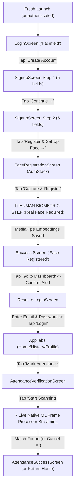

# FaceField Autonomous E2E & Real-Device Reliability Testing Harness

A self-contained, isolated end-to-end automated testing system built for **FaceField** (`com.helloworld`) running against a **REAL Android physical device** connected via ADB.

Local regression checks (no device needed): `npm ci --ignore-scripts`, `npm test`, `npm run typecheck`, `pwsh -NoProfile -File tests/camera-evidence.tests.ps1`, then from `android/`, `gradlew.bat :app:testDebugUnitTest :app:lintDebug`. Build the signed release with `pwsh -NoProfile -File scripts/build-release.ps1`; see `scripts/RELEASE.md` for signing setup. Storage tests mock the native bridge; native Keystore encryption and live-camera/model behavior still require Android device validation.

Enrollment requires a live face: tap capture, blink, then hold still. Existing local records migrate before navigation; migration errors preserve the old data and show a retry screen. Do not use `-FreshInstall` when validating migration, because it uninstalls the app and its data. AWS synchronization is not implemented and the UI does not claim an upload or purge.

---

## 1. Directory Structure

```
e2e-tests/
├── config/
│   ├── .env                     # Local active test configuration (git-ignored)
│   ├── .env.example             # Clean template configuration
│   └── load-env.ps1             # Safe process-level environment loader
├── flows/                       # Maestro declarative automation flows
│   ├── 01-create-account.yaml   # Account creation (Step 1 & Step 2 form filling)
│   ├── 02-face-registration.yaml# Face enrollment & human biometric boundary
│   ├── 03-login.yaml            # Authentication with registered credentials
│   ├── 04-tab-navigation.yaml   # Tab navigation (Home -> History -> Profile -> Home)
│   ├── 05-attendance-camera.yaml# Attendance camera & ML frame processor lifecycle
│   ├── 06-logout.yaml           # Profile screen logout & alert confirmation
│   ├── 07-returning-user-login.yaml # Returning user session restoration
│   ├── stress-camera-lifecycle.yaml # Repeated camera open/scan/dwell/close loop
│   └── stress-tab-navigation.yaml   # Rapid tab switching stress
├── scripts/                     # Windows .bat entrypoints + PowerShell engines
│   ├── check-device.bat / .ps1  # Hardware & ADB verification, exports device-info.json
│   ├── install-release.bat / .ps1# Release APK compilation, safety checks, install
│   ├── start-monitoring.bat / .ps1# Background logcat capture + filtered crash monitor
│   ├── stop-monitoring.bat / .ps1# Process termination & forensic crash signature scan
│   ├── memory-snapshot.bat / .ps1# dumpsys meminfo parser appended to CSV
│   ├── run-smoke-test.bat / .ps1 # Quick functional smoke test
│   ├── run-stress-test.bat / .ps1# Camera & ML pipeline stress loop (N cycles)
│   ├── run-soak-test.bat / .ps1  # Long-running stability & thermal testing
│   ├── generate-report.bat / .ps1# Generates structured Markdown report
│   └── full-release-test.bat / .ps1# Master orchestrator: device -> install -> test -> report
├── results/                     # Test outputs and diagnostic evidence (git-ignored)
│   ├── latest.json              # Machine-readable JSON summary for AI debugging agents
│   ├── device-info.json         # Real hardware metrics
│   ├── apk-info.json            # Installed APK metadata
│   ├── crash-forensics.json     # Quantitative forensic crash metrics
│   ├── memory/
│   │   └── memory.csv           # Time, label, PID, Total PSS, Native Heap, Java Heap, Graphics
│   ├── logcat/                  # Continuous full and filtered logcat captures
│   ├── reports/                 # Comprehensive Markdown and text test reports
│   ├── screenshots/             # Visual state captures and crash snapshots
│   └── failures/                # Diagnostic evidence bundles on failure
└── README.md                    # This document
```

---

## 2. Discovered Application Flow

The active application is the root `client/` and `android/` project. `Source_Code/` is a legacy snapshot, excluded from Metro and never used by the release installer.

Camera flows require the `camera-analysis-ready` UI marker. ADB camera loops additionally require fresh, app-PID-scoped CameraX binding, preview streaming and completed analysis logs in every cycle. A living process alone is not a pass. Failed Maestro flows and missing flows fail the suite, including biometric timeouts when no live person is present.



---

## 3. Physical Device Prerequisites

1. Connect Android phone via USB cable.
2. Enable **Developer Options** and **USB Debugging**.
3. On Xiaomi / HyperOS / MIUI devices:
   - Enable **Install via USB** (under Developer Options).
   - If Maestro is used, accept the on-screen prompt allowing `maestro-server` installation.
4. Verify ADB connection:
   ```cmd
   adb devices -l
   ```
   Must display the device with status `device` (not `unauthorized` or `offline`).

---

## 4. One-Command Quick Execution

### Master Release Test (Recommended)
```cmd
e2e-tests\scripts\full-release-test.bat -Mode quick
```
Or for full comprehensive run (onboarding + navigation + camera + stress + forensics):
```cmd
e2e-tests\scripts\full-release-test.bat -Mode full
```

### Camera & Native ML Pipeline Stress Test (N Cycles)
To repeatedly test the CameraX + MediaPipe native pipeline for crashes without requiring attendance recognition (an existing logged-in account is required):
```cmd
e2e-tests\scripts\run-stress-test.bat -Cycles 20
```

### Quick Smoke Test
```cmd
e2e-tests\scripts\run-smoke-test.bat
```

### Long-Running Soak Test
```cmd
e2e-tests\scripts\run-soak-test.bat -DurationMinutes 30
```

---

## 5. Native Crash Forensics

Special scrutiny is applied to detect the historical release crash signature:
- Signal: `Fatal signal 7 (SIGBUS), code 1 (BUS_ADRALN)`
- Components: `librnworklets.so`, `libVisionCamera.so`, `JFrameProcessor::callWithFrameHostObject`
- General signals: `SIGSEGV`, `SIGABRT`, `OutOfMemoryError`, `FATAL EXCEPTION`

The test harness runs a dedicated continuous crash monitor alongside full system logcat. Background monitors filter out `adbd` command reflection to ensure zero false positives. Results are saved in machine-readable format to `results/crash-forensics.json`.

---

## 6. Memory Monitoring & Leak Detection

Memory is sampled using `adb shell dumpsys meminfo com.helloworld` and parsed into `results/memory/memory.csv` with fields:
- `TotalPssKB`: Total Proportional Set Size
- `NativeHeapKB`: Native C++ / TFLite / MediaPipe allocations
- `JavaHeapKB`: Dalvik / ART heap
- `GraphicsKB`: SurfaceView / TextureView / OpenGL buffers
- `CodeKB`: Executable code mappings
- `StackKB`: Thread stack allocations

Checkpoints are recorded at:
- `baseline` (app launch)
- `stress-cycle-1`, `stress-cycle-5`, `stress-cycle-10`, `stress-cycle-20`, etc.
- `post-stress` (immediate camera tear-down)
- `final` (cooldown)

---

## 7. Machine-Readable Results (`results/latest.json`)

Every test run outputs a standardized JSON payload intended for automated consumption by AI coding agents:
```json
{
  "mode": "full",
  "overallStatus": "PASSED",
  "durationSeconds": 128.4,
  "device": {
    "model": "24115RA8EI",
    "manufacturer": "Xiaomi",
    "android": "16",
    "abi": "arm64-v8a",
    "ramMB": 7380
  },
  "stressCyclesAttempted": 20,
  "stressCyclesCompleted": 20,
  "processRestarts": 0,
  "crashes": {
    "sigbus": 0,
    "sigsegv": 0,
    "sigabrt": 0,
    "oom": 0,
    "fatal": 0,
    "historicalSignature": false
  },
  "memory": {
    "baseline": 131352,
    "peak": 132100,
    "final": 72089
  }
}
```

---

## 8. Removal / Isolation Guarantee

The entire testing framework is strictly contained within `e2e-tests/`. Deleting this folder removes all test files, scripts, logs, and artifacts without affecting any production React Native or Android source code.
